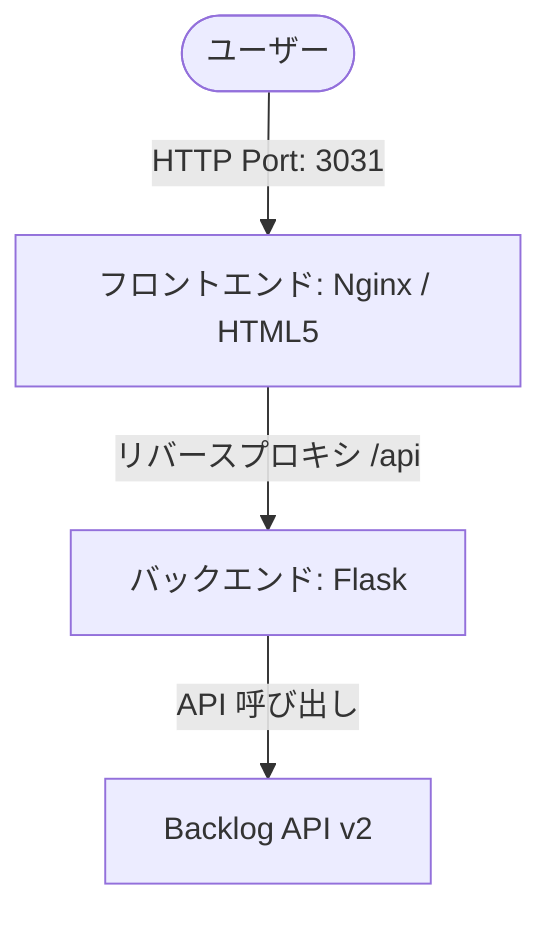

# BPM2 (進捗監視盤) システム仕様書

BPM2は、Backlog の親課題・子課題の情報を元に、予実進捗や健全性をリアルタイムで可視化するダッシュボードシステムです。

---

## 1. システム概要
Backlog API を利用して特定のプロジェクトから課題（案件と子課題）を取得し、予定工数・実績工数の対比、進捗率、カスタムステータス、チェック状態、そして工数や期限に基づく「健全性」を一覧表示します。

主な目的は、各案件の進捗遅れや工数超過の早期検知（アラート）および可視化です。

---

## 2. システム構成・アーキテクチャ

システムは Docker Compose によって管理されるマルチコンテナ構成です。



### コンテナ構成
1. **フロントエンド (frontend)**: Nginx
   - 静的ファイル (`index.html`) を配信。
   - `nginx.conf` により、`/api` へのリクエストをバックエンドへリバースプロキシ。
   - 公開ポート: ホスト `3031` -> コンテナ `80`。
2. **バックエンド (backend)**: Python (Flask)
   - Backlog API からデータを取得・整形し、フロントエンドに JSON 形式で返却。
   - API 制限を回避するためのインメモリキャッシュ機構を搭載。
   - ポート: コンテナ `5000` (外部公開なし)。

---

## 3. バックエンド仕様 (Flask API)

### 3.1 エンドポイント

| メソッド | パス | 説明 | レンスポンス形式 |
| :--- | :--- | :--- | :--- |
| `GET` | `/api/issues` | 親課題および紐づく子課題の進捗データ一覧を取得。 | JSON (配列) |
| `GET` | `/api/health` | バックエンドの死活監視および設定値の確認。 | JSON |

### 3.2 キャッシュ機構 (In-memory Cache)
Backlog API の呼び出し回数を抑制するため、以下のシンプルなインメモリキャッシュが実装されています。

* **プロジェクト情報 (`project_id`)**: 3600秒 (1時間) キャッシュ。
* **カスタムフィールド情報 (`custom_fields`)**: 3600秒 (1時間) キャッシュ。
* **課題データ (`issues`)**: 環境変数 `CACHE_TTL`（デフォルト 60秒）キャッシュ。

### 3.3 データ抽出ロジック
全件取得した Backlog 課題から、以下のように親子関係を分類します。

* **親課題 (案件)**:
  - 親課題ID (`parentIssueId`) が設定されていない (`None`)。
  - 課題種別名 (`issueType.name`) が `"00.案件"`。
  - 状態名 (`status.name`) が `"完了"` 以外。
* **子課題**:
  - 親課題ID (`parentIssueId`) が設定されている。

### 3.4 健全性 (ヘルス) 判定ロジック
親課題ごとに、紐づくすべての**子課題の工数合計**および**親課題の期限**を元に判定します。

| 判定 | 表示アイコン | 条件 |
| :---: | :---: | :--- |
| **危険** | 🔴 | 親課題の期限を超過している<br>または、子課題の実績工数の合計が予定工数の合計の 120% を超えている |
| **注意** | 🟡 | 親課題の期限まで 3 日以内である<br>または、子課題の実績工数の合計が予定工数の合計を超えている |
| **正常** | 🟢 | 上記のいずれにも該当しない |

---

## 4. カスタム属性 (Custom Fields) のマッピング

Backlog上のカスタム属性を、環境変数で指定されたフィールド名に基づいて取得します。

| 項目 | 対象課題 | 環境変数名 (デフォルト値) | 取得・変換仕様 |
| :--- | :--- | :--- | :--- |
| **進捗率** | 子課題 | `PROGRESS_FIELD_NAME`<br>(デフォルト: `"進捗率"`) | 数値・ラジオボタン・リスト・複数選択からテキストを取得。<br>正規表現 `([\d.]+)` にマッチした数値を整数化。 |
| **ステータス** | 親課題 | `STATUS_FIELD_NAME`<br>(デフォルト: `"ステータス"`) | 親課題の現在の進捗フェーズを表す属性（例: `20【Ｃ】基本設計 - 依頼有`）。文字列として取得。 |
| **チェック状態** | 子課題 | `CHECK_STATUS_FIELD_NAME`<br>(デフォルト: `"チェック状態"`) | 子課題の進捗段階を表す属性（例: `30:レビュー済み`）。文字列として取得。 |

---

## 5. フロントエンド仕様 (UI / UX)

### 5.1 画面構成
* **ヘッダー**: システムロゴ、現在のプロジェクト名、同期状態 (「取得中...」「最終同期時刻」「エラーメッセージ」)、手動「↻ 更新」ボタン。
* **サマリーバー**:
  - 案件数: 進行中と完了の件数
  - 予定工数合計 / 実績工数合計 / 予実差分 / 健全性割合
* **フィルターバー**:
  - 健全性による絞り込み (すべて、🟢、🟡、🔴)
  - 状態による絞り込み (対応中、完了)
  - 担当者による絞り込み (親課題の担当者一覧からプルダウン選択)
  - 子課題のソート順 (「担当者 ➔ 期間」または「期間 ➔ 担当者」)
  - ステータスによる絞り込み (見積、設計、正式、開発、テスト、本番)
* **進捗監視テーブル**:
  - 親課題（案件）を1行で表示し、左端の `▶` ボタンで子課題の展開が可能。
  - 親行には、子課題から集計された予定工数、実績工数、予実の差分、進捗バー（予定に対する実績）を表示。
  - 子行には、個々の子課題の担当者、期間、予定/実績工数、進捗率、状態、および「チェック状態」をバッジとして表示。

---

## 6. 環境変数設定 (.env)

システム起動に必要な環境変数は以下の通りです。

```ini
# Backlog 接続設定
BACKLOG_SPACE=yourspace.backlog.com       # BacklogのスペースURL
BACKLOG_API_KEY=your_api_key_here         # APIキー
BACKLOG_PROJECT_KEY=ASPIT                 # 対象プロジェクトキー

# キャッシュ TTL (秒)
CACHE_TTL=60                              # バックエンド側でのAPIキャッシュ時間

# カスタム属性名のマッピング設定 (任意)
PROGRESS_FIELD_NAME=進捗率                 # 子課題の進捗率カスタム属性名
STATUS_FIELD_NAME=ステータス               # 親課題のステータスカスタム属性名
CHECK_STATUS_FIELD_NAME=チェック状態       # 子課題のチェック状態カスタム属性名
```
